# Architecture Overview

This project follows a modern, distributed architecture designed for high-performance AI content generation and social media automation.

## System Components

### 1. Frontend (React + Puter.js)
- **Framework**: Vite + React
- **Styling**: Premium Dark Mode CSS with Glassmorphism effects.
- **Image Engine**: **Puter.js (Flux.1 Schnell)**. 
    - *Logic*: Instead of generating images on the backend, the frontend receives optimized prompts and uses the `puter.ai.txt2img` engine to generate high-fidelity 8k marketing visuals directly in the browser.
- **Polling**: Real-time polling of the backend `/status/{task_id}` endpoint to track progress.

### 2. Backend (FastAPI + Celery + Redis)
- **API Framework**: FastAPI
- **Task Orchestration**: Celery
- **Message Broker**: Redis
- **Text Engine**: **OpenRouter (Mistral / Gemini Flash Lite)**.
    - *Logic*: Handles complex multi-step prompt engineering to generate JSON-structured campaign data.
- **Automation Layer**: **Playwright**.
    - *Logic*: Spawns headed Chrome instances to handle social media publishing, allowing for manual 2FA/Login bypass while automating text injection.

### 3. AI Services Layer
- **OpenRouter**: Unified API for LLM access (Text generation).
- **Puter.js**: Browser-integrated AI ecosystem (Image generation).

## Data Flow Diagram

```mermaid
graph TD
    A[User Brief] -->|POST /generate| B(FastAPI)
    B -->|delay| C{Celery Worker}
    C -->|AI Request| D[OpenRouter]
    D -->|JSON| C
    C -->|Store Result| E[(Redis)]
    F[React UI] -->|Poll Status| B
    B -->|Fetch| E
    F -->|Prompts| G[Puter.js]
    G -->|Flux Image| F
    F -->|Publish| H[Playwright Automation]
    H -->|Browser Injection| I[LinkedIn / Twitter]
```

